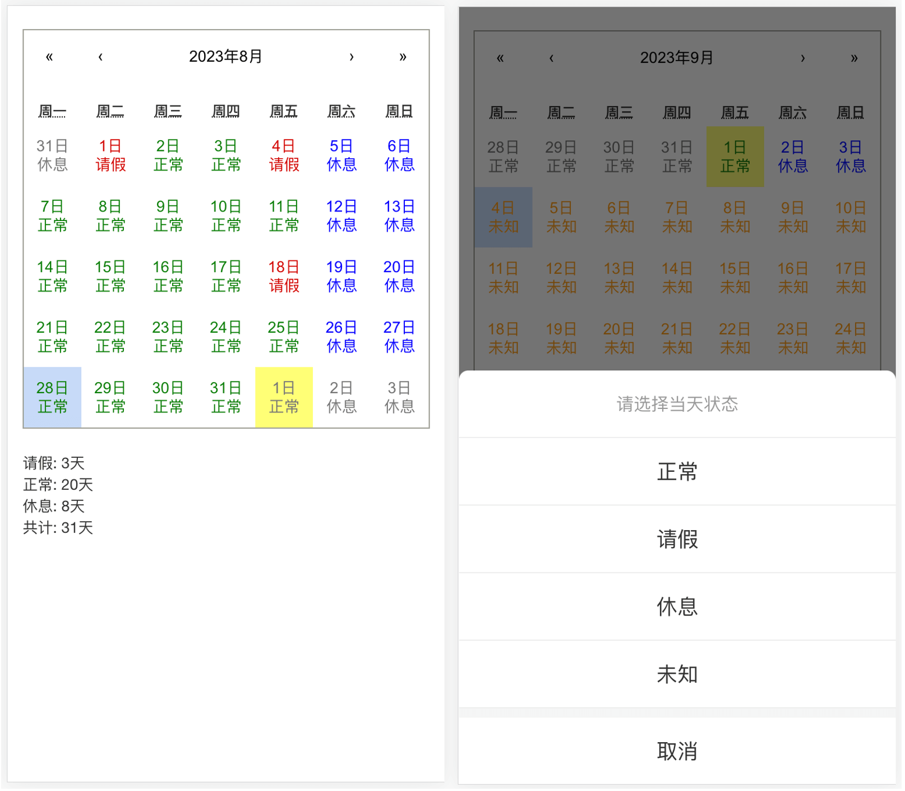

# calendar-state

## 项目简介

用`React`写的一个日历，可以记录每日的状态，数据保存至`PostgreSQL`数据库

## 项目背景

孩子上幼儿园了，但是偶尔会请假。每个月幼儿园老师都要向家长确认孩子的出勤情况。因此做了本项目来记录。

## 前端

- 使用 [create-react-app](https://create-react-app.dev/) 命令创建最简单的 React 前端项目
- 使用 [react-calendar](https://www.npmjs.com/package/react-calendar) 组件实现日历功能
- [主要代码](./frontend/src/App.js)

## 后端

- 使用 `Python` 的 [flask](https://flask.palletsprojects.com/) 框架编写最简单的web接口
- 使用 `psycopg2` 模块连接`PostgreSQL`数据库，以保证数据的持久化
- [主要代码](./backend/main.py)

## 接口说明

| 请求方法 | 接口地址           | 说明      |
|------|----------------|---------|
| GET  | /calendar/data | 查询保存的数据 |
| POST | /calendar/data | 更新数据    |

## 数据库说明

表名：calendar_state

| 字段名  | 字段说明   |
|------|--------|
| id   | 主键     |
| data | json数据 |

## 部署

使用`Nginx`将前后端代理到同一个端口下，否则会有跨域问题

## 其他

python真香
